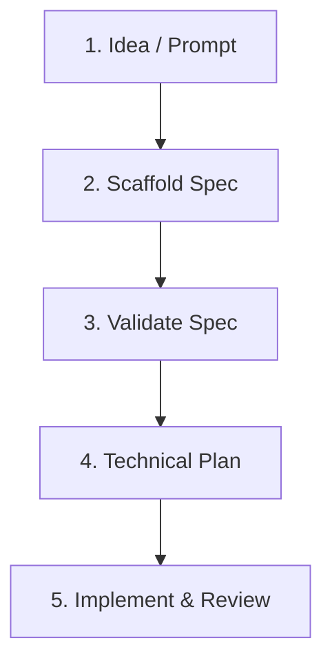

# coding-spec Workflow Guide

The toolkit ships a command path from idea to technical plan, plus spec validation and an implementation review checklist. A new user can complete init → spec → plan in under ten minutes.



## Step 1: Initialize

```bash
./bin/coding-spec init
```

Creates `docs/`, `templates/`, `examples/`, `prompts/`, `src/`, and `tests/` in your project and copies the canonical markdown templates.

## Step 2: Scaffold a Spec

```bash
./bin/coding-spec spec "Add team billing"
```

Generates `docs/specs/add-team-billing.md` from the spec template. Fill in user stories, acceptance criteria, non-goals, and test considerations before moving on.

## Step 3: Validate the Spec

```bash
./bin/coding-spec validate docs/specs/add-team-billing.md
```

Checks the spec for completeness: acceptance criteria with concrete items and a test-considerations section are required (errors), and a non-goals / out-of-scope section is recommended (warning). Returns a non-zero exit code when required sections are missing, so it can gate a commit or CI step.

## Step 4: Generate a Technical Plan

```bash
./bin/coding-spec plan docs/specs/add-team-billing.md
```

Produces `docs/plans/add-team-billing-plan.md` from the plan template. Use it as the handoff document for your coding agent.

## Step 5: Review the Implementation

```bash
./bin/coding-spec review docs/specs/add-team-billing.md
```

Writes `docs/plans/add-team-billing-review.md`, a checklist that pairs each acceptance criterion with matching code evidence found in the repository so you can confirm the implementation covers the spec.

## What comes next

Phase 3 adds agent export modes and CI integration.