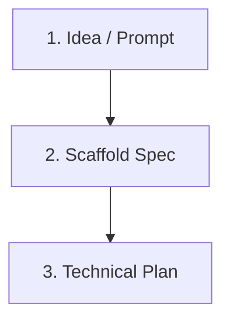

# coding-spec Workflow Guide

Phase 1 ships a three-command path from idea to technical plan. A new user can complete it in under ten minutes.



## Step 1: Initialize

```bash
./bin/coding-spec init
```

Creates `docs/`, `templates/`, `examples/`, `prompts/`, `src/`, and `tests/` in your project and copies the canonical markdown templates.

## Step 2: Scaffold a Spec

```bash
./bin/coding-spec spec "Add team billing"
```

Generates `docs/specs/add-team-billing.md` from the spec template. Fill in user stories, acceptance criteria, non-goals, and test considerations before moving on.

## Step 3: Generate a Technical Plan

```bash
./bin/coding-spec plan docs/specs/add-team-billing.md
```

Produces `docs/plans/add-team-billing-plan.md` from the plan template. Use it as the handoff document for your coding agent.

## What comes next

Phase 2 adds validation rules, review checklists, and snapshot tests. Phase 3 adds agent export modes and CI integration.