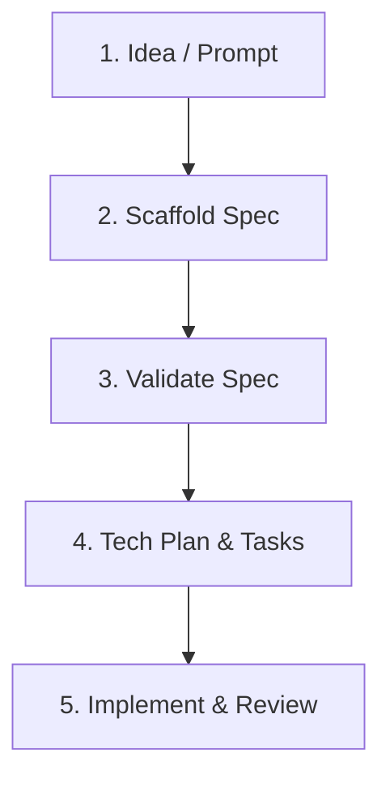

# coding-spec Workflow Guide

The coding-spec workflow consists of five clear phases to transition from an idea to a shipped feature:

## Phase 1: Idea / Prompt
Start with a short description of the feature you want to build (e.g. "Add password reset workflow").

## Phase 2: Scaffold Spec
Run `spec` command to generate a template-based spec. Populate details like:
- Target audience
- Acceptance criteria (functional & edge cases)
- Explicit out-of-scope non-goals

## Phase 3: Validate Spec
Run `validate` command. The validator checks for:
- Under-specified criteria
- Unclear scope (lack of Non-Goals section)
- Missing testing strategies or test considerations

## Phase 4: Technical Plan & Tasks
Run `plan` command to convert the validated spec into a technical plan file. Break the plan down into step-by-step tasks with clear implementation order.

## Phase 5: Implement & Review
Assign the generated plan and tasks to your coding agent. Once coding is complete, perform a review audit using the generated review checklist.
